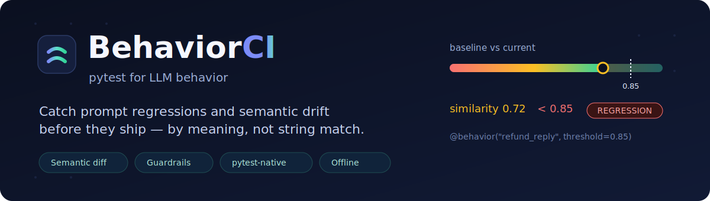
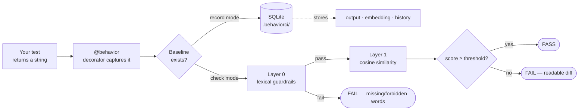

<div align="center">
  

  <p>
    <a href="https://github.com/0-uddeshya-0/BehaviorCI/actions/workflows/ci.yml"></a>
    <a href="https://www.python.org/downloads/"></a>
    <a href="LICENSE"></a>
    <a href="https://github.com/psf/black"></a>
    
  </p>
</div>

BehaviorCI is a pytest plugin that snapshots what your prompt-based functions
*say* and fails the build when the meaning drifts. You write an ordinary test,
return the generated string, and BehaviorCI records a baseline the first time it
runs. On later runs it compares the new output to the baseline **by semantic
similarity**, so a reworded-but-equivalent answer passes and a genuine
regression fails — even when the exact wording was never going to match.

```python
from behaviorci import behavior

@behavior("refund_reply", threshold=0.85, must_contain=["business days"])
def test_refund_reply():
    return assistant("How long does a refund take?")   # return the model's text
```

```console
$ pytest --behaviorci-record     # first run: save the baseline
$ pytest --behaviorci            # later runs: fail on drift
```

---

## Why this exists

You tweak a prompt, switch a model, or bump a temperature. Your unit tests still
pass, because they only check the parts you hard-coded. Then a downstream parser
breaks, or the tone goes cold, or the assistant quietly stops mentioning the one
thing it has to mention.

`assert reply == "..."` can't help here — generative output is never byte-stable.

```text
Baseline : "Your refund will be processed in 3–5 business days."
New build : "Refund approved. Processing time: 3–5 days."
            same meaning, different string  →  exact-match test is useless
```

BehaviorCI treats the output like a snapshot test (think Jest), but the
comparison is an **embedding cosine similarity** instead of string equality.
Record once, compare forever, fail on drift.

---

## Highlights

- **Semantic, not literal** — cosine similarity over sentence embeddings, with a
  per-test `threshold`.
- **Guardrails** — `must_contain` / `must_not_contain` lexical checks run first
  and fail fast, independent of similarity.
- **Variance-aware thresholds** — naturally noisy prompts loosen their own
  threshold over time; rigid ones (JSON, classifiers) stay strict.
- **Centroid baselines** — sample a creative prompt N times and compare against
  the average, so high-temperature outputs don't false-alarm.
- **Local-first & offline** — the embedding model downloads once (~80 MB), then
  every run is offline and free. No API keys required.
- **Bring your own embedder** — inject OpenAI, Cohere, Gemini, or anything else
  with a three-line adapter; the local model becomes optional.
- **Built for CI** — record-missing mode, a machine-readable JSON report, WAL
  storage that survives `pytest -n auto`, async test support, and parametrized
  tests.

---

## Install

```bash
# Lightweight core — bring your own (API) embedder
pip install "git+https://github.com/0-uddeshya-0/BehaviorCI.git"

# With the local embedding model (sentence-transformers + torch, ~1 GB)
pip install "behaviorci[local] @ git+https://github.com/0-uddeshya-0/BehaviorCI.git"
```

> **Heads up on the name:** the `behaviorci` name on PyPI currently points to an
> unrelated project, so install from this repository for now. See
> [Roadmap](#roadmap) for the publishing plan.

Requires Python 3.10+.

---

## Quick start (about a minute)

**1. Write a behavior test.** It's a normal test that returns the string you
want to track.

```python
# test_support.py
from behaviorci import behavior
from myapp import assistant

@behavior("support_tone", threshold=0.88, must_contain=["help"])
def test_support_tone():
    return assistant("I'm frustrated with my bill")
```

**2. Record the baseline.** Read the captured output — it becomes your ground
truth, so make sure it isn't a hallucination.

```console
$ pytest test_support.py --behaviorci-record
```
```text
------------------------------- BehaviorCI -------------------------------
Recorded snapshot: support_tone
Snapshot ID: 9f1c2a7b4e6d8a03...

Review the captured output below to make sure it is correct --
it becomes the baseline for future runs.
==================================================
I'm sorry you're dealing with this. I can help sort the bill out right now…
==================================================
```

**3. Check for regressions.** Change a prompt or model, then run the check.

```console
$ pytest test_support.py --behaviorci
```
```text
FAILED test_support.py::test_support_tone
BehaviorCI: Similarity 0.7100 < threshold 0.8800

==================================================
BEHAVIORAL REGRESSION DETECTED
==================================================

Semantic similarity: 0.7100

--- STORED OUTPUT (Primary Sample) ---
I'm sorry you're dealing with this. I can help sort the bill out right now…

--- CURRENT OUTPUT (Primary Sample) ---
Billing is handled by the finance team. Email finance@example.com.

==================================================
Run with --behaviorci-update to accept the new behavior
==================================================
```

**4. Accept intentional changes.** If the new behavior is correct, update the
baseline.

```console
$ pytest test_support.py --behaviorci-update
```

That's the whole loop: **record → check → update.**

---

## How it works



1. **Capture.** The `@behavior` decorator wraps your test, runs it once, and
   stashes the returned string plus a canonical hash of the inputs.
2. **Layer 0 — lexical guardrails.** `must_contain` / `must_not_contain` are
   checked first. They're cheap, deterministic, and catch "it stopped saying the
   refund window" before any math happens.
3. **Layer 1 — semantic similarity.** The output is embedded and compared to the
   baseline with cosine similarity. Below the (effective) threshold ⇒ fail, with
   a side-by-side diff.
4. **Store.** Snapshots, embeddings, the model name, an optional git commit, and
   every measured score live in a local SQLite database under `.behaviorci/`.

---

## Core concepts

### The `@behavior` decorator

```python
@behavior(
    "unique_behavior_id",          # required, unique across the suite
    threshold=0.85,                # minimum cosine similarity (0–1)
    must_contain=["refund"],       # optional lexical guard
    must_not_contain=["password"], # optional lexical guard
    samples=1,                     # >1 enables a centroid baseline
)
def test_something():
    return generate(...)           # MUST return a str (or list[str] if samples>1)
```

The test's **return value** is the behavior under test. A test that returns
`None` (or a non-string) fails loudly, so you never record an empty baseline by
accident.

### Variance-aware thresholds

Some prompts are stable; others wander. BehaviorCI watches each snapshot's recent
score history and adapts:

- **Fewer than 3 prior runs:** your `threshold` is used as-is.
- **3+ runs:** the effective threshold becomes
  `max(0.5, min(threshold, mean(history) − 2·std))`.

So a high-variance prompt loosens toward its own observed floor (never below
0.5), while a low-variance prompt keeps your strict threshold. You get fewer
false alarms without hand-tuning every test.

### Centroid baselines for creative output

For deliberately non-deterministic prompts (storytelling, brainstorming,
high temperature), comparing against a single sample is noisy. Pass `samples=N`
and BehaviorCI runs the test N times, averages the embeddings into a "center of
mass", and compares against that.

```python
@behavior("story_intro", threshold=0.75, samples=5)
def test_story_intro():
    return write_intro("a lighthouse keeper")   # called 5×, embeddings averaged
```

### Async and parametrized tests

`@behavior` supports `async def` tests, and it composes with
`@pytest.mark.parametrize` — each parameter set hashes to its own snapshot.

```python
@pytest.mark.parametrize("topic", ["billing", "shipping", "returns"])
@behavior("faq_answer", threshold=0.85)
def test_faq(topic):
    return answer_faq(topic)     # three independent baselines
```

---

## CLI

Everything works through pytest flags, but a thin `behaviorci` CLI wraps the
common flows and adds inspection commands.

| Command | What it does |
| --- | --- |
| `behaviorci record [path]` | Record/overwrite baselines |
| `behaviorci check [path]` | Fail on regressions (CI mode) |
| `behaviorci update [path]` | Accept new behavior for failing tests |
| `behaviorci record-missing [path]` | Record only what's missing, check the rest |
| `behaviorci stats` | Totals plus a per-behavior table |
| `behaviorci history <id>` | Similarity over time for a behavior |
| `behaviorci clear --force` | Delete all snapshots |

Every command accepts `--db PATH` to point at a non-default database.

```console
$ behaviorci history refund_reply
Behavior: refund_reply   (snapshot 4eb1e60f5a11)
Input:    {"args": [], "kwargs": {}}
  2026-06-16 09:39   0.9013  [######################--]
  2026-06-15 17:02   0.8456  [####################----]
  2026-06-14 11:20   0.7220  [#################-------]
```

### Machine-readable report

Add `--behaviorci-report report.json` to any run to emit a structured summary
for dashboards, PR comments, or downstream automation:

```json
{
  "schema": "behaviorci/report/v1",
  "mode": "check",
  "model": "sentence-transformers/all-MiniLM-L6-v2",
  "summary": { "total": 12, "passed": 11, "failed": 1, "recorded": 0, "checked": 12 },
  "results": [
    {
      "behavior_id": "refund_reply",
      "action": "checked",
      "passed": false,
      "similarity": 0.71,
      "effective_threshold": 0.85,
      "nodeid": "tests/test_support.py::test_refund_reply"
    }
  ]
}
```

---

## Continuous integration

The pattern that scales: **check existing behaviors strictly, auto-record brand
new ones** so a freshly added test doesn't fail the build before anyone has
reviewed its baseline.

```yaml
# .github/workflows/behavior.yml
name: Behavior
on: [push, pull_request]

jobs:
  behavior:
    runs-on: ubuntu-latest
    steps:
      - uses: actions/checkout@v4
      - uses: actions/setup-python@v5
        with:
          python-version: "3.12"

      - name: Cache the embedding model
        uses: actions/cache@v4
        with:
          path: ~/.cache/huggingface
          key: ${{ runner.os }}-behaviorci-model

      - run: pip install "behaviorci[local] @ git+https://github.com/0-uddeshya-0/BehaviorCI.git" pytest

      - run: pytest --behaviorci-record-missing --behaviorci-report bci.json

      - uses: actions/upload-artifact@v4
        with:
          name: behaviorci-report
          path: bci.json
```

Baselines live in `.behaviorci/behaviorci.db`. Commit it to version your
behavior alongside your code (see [Team workflows](#team-workflows-for-the-binary-database)).

---

## Bring your own embedder

The core install ships without PyTorch. To run fully offline, add the `[local]`
extra. To avoid the heavy dependency entirely, inject any embedding API by
subclassing `BaseEmbedder` in your `conftest.py`:

```python
# conftest.py
import numpy as np
from openai import OpenAI
from behaviorci.embedder import BaseEmbedder, set_embedder

class OpenAIEmbedder(BaseEmbedder):
    def __init__(self):
        super().__init__(model_name="text-embedding-3-small")
        self.client = OpenAI()

    def embed_single(self, text: str) -> np.ndarray:
        vec = self.client.embeddings.create(
            input=text, model=self.model_name
        ).data[0].embedding
        vec = np.asarray(vec, dtype=np.float32)
        return vec / np.linalg.norm(vec)   # BehaviorCI expects unit vectors

set_embedder(OpenAIEmbedder())   # used for the whole session
```

The `model_name` is stored with each snapshot. If you later compare against a
baseline recorded with a different model, BehaviorCI raises a clear
`ModelMismatchError` instead of silently comparing vectors from incompatible
spaces.

---

## Where it fits

| Tool | Approach | Runs | Best for |
| --- | --- | --- | --- |
| **BehaviorCI** | Snapshot + embedding similarity | Local / CI, offline | Regression-gating prompts in the test suite you already have |
| Promptfoo | Prompt A/B + assertions | CLI, cloud option | Iterating and comparing prompt variants |
| DeepEval | Metric-based scoring | pytest, cloud | Quality metrics (faithfulness, relevancy) |
| LangSmith | Tracing + eval UI | Cloud | Observability and debugging in production |

BehaviorCI is intentionally small: it does snapshot-style regression testing
well and stays out of the way of whatever else you use.

---

## Team workflows (for the binary database)

Snapshots live in a single SQLite file. Git can't merge two binary files, so
when several people record new baselines on different branches at once, you can
get conflicts.

- **CI stays read-only.** `pytest --behaviorci` on pull requests is always safe.
- **Record on a known branch.** Run `--behaviorci-record` / `--behaviorci-update`
  on `main`, or let one maintainer own baseline updates.
- WAL sidecar files (`*.db-wal`, `*.db-shm`) are throwaway and already
  `.gitignore`d.

A Git-friendly JSON snapshot backend is on the [roadmap](#roadmap).

---

## Troubleshooting

<details>
<summary><strong>"No snapshot found" in CI</strong></summary><br>
A new test has no baseline committed. Use <code>--behaviorci-record-missing</code>
so CI records it instead of failing, then review and commit the database.
</details>

<details>
<summary><strong>High similarity but the test still fails</strong></summary><br>
A lexical guard fired. Look for "Missing required" or "Found forbidden" in the
failure — <code>must_contain</code> / <code>must_not_contain</code> are enforced
regardless of the similarity score.
</details>

<details>
<summary><strong>ModelMismatchError</strong></summary><br>
The baseline was recorded with a different embedding model. Re-record with
<code>--behaviorci-update</code>, or point at the original model with
<code>--behaviorci-model</code>.
</details>

<details>
<summary><strong>First run is slow</strong></summary><br>
The local model (~80 MB) downloads once from Hugging Face. Cache
<code>~/.cache/huggingface</code> in CI; later runs are offline.
</details>

<details>
<summary><strong>"database is locked" under pytest-xdist</strong></summary><br>
The database runs in WAL mode with per-thread connections, so parallel runs are
supported. If you see this, make sure no external process is holding the file
open.
</details>

---

## Roadmap

- Git-friendly JSON snapshot backend (no more binary-merge friction).
- Publish to PyPI under an available name once the JSON backend lands.
- Optional HTML drift report from the JSON output.

---

## Contributing

Contributions are welcome — see [CONTRIBUTING.md](CONTRIBUTING.md).

```bash
git clone https://github.com/0-uddeshya-0/BehaviorCI.git
cd BehaviorCI
pip install -e ".[dev,local]"
pytest                       # full suite
pytest -n auto -m "not slow" # parallel
```

## License

MIT — see [LICENSE](LICENSE).
