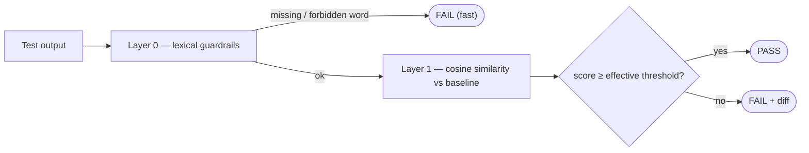

# Guide

## The `@behavior` decorator

```python
@behavior(
    "unique_behavior_id",          # required, unique across the whole suite
    threshold=0.85,                # minimum cosine similarity (0–1)
    must_contain=["refund"],       # optional lexical guard
    must_not_contain=["password"], # optional lexical guard
    samples=1,                     # >1 enables a centroid baseline
)
def test_something():
    return generate(...)
```

The test's **return value** is the behavior under test, and it must be a string
(or, with `samples > 1`, the decorator collects one string per call). A test
that returns `None` or a non-string fails immediately, so you never record an
empty baseline by mistake.

Behavior ids must be unique. BehaviorCI checks this at collection time and stops
the run with a clear error if two tests share an id — otherwise one would
silently overwrite the other's baseline.

## How a check is evaluated

Each check runs in two layers:



Lexical guards run first because they're cheap and unambiguous: if the output
stopped saying "business days", you want to know that regardless of how similar
the embeddings are.

## Guardrails

```python
@behavior(
    "safety",
    threshold=0.8,
    must_contain=["sources"],          # every item must appear (case-insensitive)
    must_not_contain=["password", "ssn"],  # none of these may appear
)
def test_answer_cites_sources():
    return answer("What changed in v2?")
```

A guardrail failure reports exactly which words were missing or forbidden, and
it fails the test even if the similarity score is high.

## Variance-aware thresholds

Some prompts are stable; others naturally wander. BehaviorCI tracks each
snapshot's recent score history and adapts the threshold:

- **Fewer than 3 prior runs:** your `threshold` is used unchanged.
- **3 or more runs:** the effective threshold becomes

    ```text
    max(0.5, min(threshold, mean(history) − 2 × std(history)))
    ```

A high-variance prompt loosens toward its own observed floor (never below 0.5),
while a low-variance prompt keeps your strict threshold. The failure report
shows both the base and the effective threshold when they differ.

## Centroid baselines (creative output)

For deliberately non-deterministic prompts, comparing to a single sample is
noisy. Pass `samples=N`: BehaviorCI invokes the test `N` times, averages the
embeddings into a "center of mass", and compares against that average.

```python
@behavior("story_intro", threshold=0.75, samples=5)
def test_story_intro():
    return write_intro("a lighthouse keeper")   # called 5×, embeddings averaged
```

The test still returns a single string per call — BehaviorCI handles the
repetition and averaging.

## Async tests

`async def` tests work without any extra ceremony:

```python
@behavior("async_reply", threshold=0.85)
async def test_async_reply():
    return await chain.ainvoke("summarize this ticket")
```

## Parametrized tests

`@behavior` composes with `@pytest.mark.parametrize`. Each parameter set hashes
to its own snapshot, so the cases never collide.

```python
@pytest.mark.parametrize("topic", ["billing", "shipping", "returns"])
@behavior("faq_answer", threshold=0.85)
def test_faq(topic):
    return answer_faq(topic)   # three independent baselines
```

## Handling non-determinism

If your output embeds timestamps, random ids, or dates, normalize or mock them
so the baseline stays meaningful:

```python
from unittest.mock import patch
from datetime import datetime

@behavior("daily_summary", threshold=0.9)
def test_daily_summary():
    with patch("myapp.today", return_value=datetime(2026, 1, 15)):
        return summarize_today()
```

## Where snapshots live

Everything is stored in a local SQLite database (default
`.behaviorci/behaviorci.db`): the baseline text, its embedding, the embedding
model name, an optional git commit, and the full similarity history used for
variance. Point at a different file with `--behaviorci-db PATH`.
